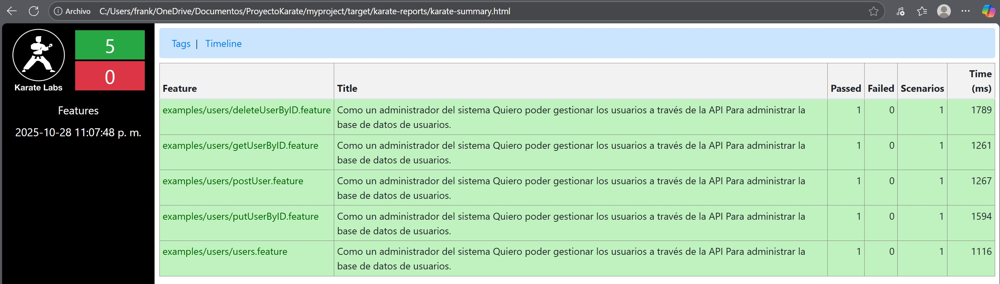

# 🧪 Pruebas de API con Karate DSL

Este proyecto contiene escenarios de prueba para validar la API de gestión de usuarios
de [Serverest.dev](https://serverest.dev/), usando Karate DSL.

## 📂 Estructura del proyecto

## ▶️ Cómo ejecutar el escenario

1. **Instala Java y Maven**  
   Asegúrate de tener Java 8+ y Maven instalados.

2. **Ejecuta el test desde terminal**
   ```bash
   mvn test o mvn test -Dkarate.options="classpath:tests/users.feature"

## ▶️ Considerar

1. **Asegurar usar diferentes emails para la generacion de los casos**
   